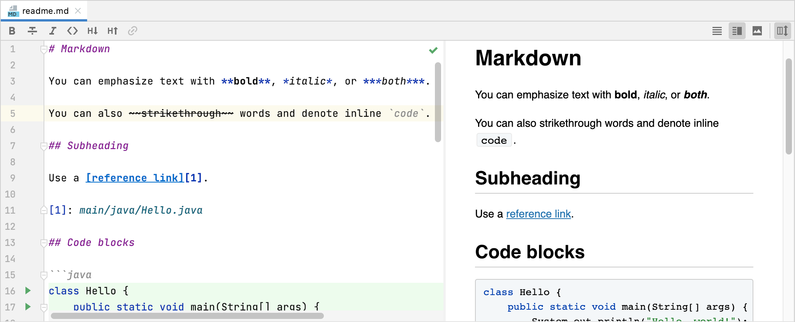
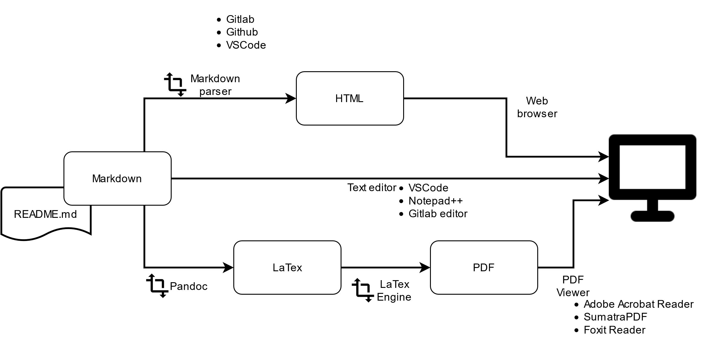

# Markdown

_un format de documentation plaintext_

1. **Markdown What?**
2. **Markdown, un format simple**
3. **Markdown au quotidien**

---

# Liens et Ressources

- [Spécification CommonMark / Fiche de révision Markdown courte (EN)](https://commonmark.org/help/)
- [Fiche de révision Markdown longue (EN)](https://github.com/adam-p/markdown-here/wiki/Markdown-Cheatsheet)
- [Présentation (FR, Ionos)](https://www.ionos.fr/digitalguide/sites-internet/developpement-web/markdown/)
- [Markdown, du HTML simple (FR, Openclassroom)](https://openclassrooms.com/fr/courses/1304236-redigez-en-markdown)

---

# I. Markdown What?

1. Exemple
2. Traitement du markdown
3. Markdown VS Word
4. Markdown VS HTML

---

# Markdown What?

> **Langage de balisage léger** créé par John Gruber en 2004, avec l'aide de Aaron Swartz avec le but **d'offrir une syntaxe facile à lire et à écrire**
>
> - .md, .markdown
> - Type MIME
> - text/markdown
> - version initiale le 19 mars 2004
>
> -- https://fr.wikipedia.org/wiki/Markdown

---

# Markdown What?

## Exemple



---

# Markdown What? - Traitement



---

# Markdown VS Word

---

# Markdown VS HTML

---

# II. Markdown, un format simple

---

# II. Markdown, un format simple

1. Titres et mise en forme de texte
1. Images et liens
1. Code
1. Liste, liste imbriquée et liste énumérée
1. Liste, entrées multilignes
1. Blockquote/citations

---

# Markdown, un format simple

## Titres et mise en forme de texte

_text italique_, **text gras**, _**italique et gras**_

```
# Markdown, un format simple

## Titres et mise en forme de texte

_text italique_, **text gras**, _**italique et gras**_
```

---

# Markdown, un format simple

## Images et liens

| code markdown | rendu |
| ------------- | ----- |
| `` |  |
| `[Fiche de révision](https://commonmark.org/help/)` | [Fiche de révision](https://commonmark.org/help/) |

---

# Markdown, un format simple

## Code

    Un exemple de `inline code` au sein d'une phrase (touche AltGr+7).

    ```
    exemple de bloc de code
    multiligne!
    ```

Un exemple de `inline code` au sein d'une phrase (touche AltGr+7).

```
exemple de bloc de code
multiligne!
```

---

# Markdown, un format simple

## Liste, liste imbriquée et liste énumérée

```
- LFSR feed avec différentes données
- LFSR parallélisable
  - temps de traversé réduit
    1. meilleur utilisation du silicium
    2. réduction des couts
```

- LFSR feed avec différentes données
- LFSR parallélisable
  - temps de traversé réduit
    1. meilleur utilisation du silicium
    2. réduction des couts

---

# Markdown, un format simple

## Liste, entrées multilignes

```
- LFSR feed avec différentes données
  LFSR parallélisable
- générateur d'aléatoire
  - pseudo-aléatoire
    (methode de Von Neumann, etc.)
```

- LFSR feed avec différentes données
  LFSR parallélisable
- générateur d'aléatoire
  - pseudo-aléatoire
    (methode de Von Neumann, etc.)

---

# Markdown, un format simple

## Blockquote/citations

```
> Simplicity is prerequisite for reliability.
> — Edsger Dijkstra
```

> Simplicity is prerequisite for reliability.
> — Edsger Dijkstra

## Règle horizontale

```
---
```


---

# III. Markdown au quotidien

---

# III. Markdown au quotidien

1. Pièges habituels
2. Solution habituelle
3. Pièges habituels
4. Solution habituelle
5. Comment faire X?
6. Ce que l'on ne peux pas faire avec Markdown
7. VSCode
8. Gitlab / Github -- Comment faire une bonne documentation?
9. Liens et Ressources
10. Pour aller plus loin

---

# Markdown au quotidien

## Pièges habituels

### Retour à la ligne

```
Salez.
Poivrez.
```

Salez. Poivrez.

---

# Markdown au quotidien

## Solution habituelle

### Retour à la ligne x2 !

```
Salez.

Poivrez.
```

Salez.

Poivrez.

---

# Markdown au quotidien

## Pièges habituels

### Créer une liste ?

```
-Salez
-Poivrez
```

-Salez -Poivrez

---

# Markdown au quotidien

## Solution habituelle

### Attention aux espaces !

```
- Salez
- Poivrez
```

- Salez
- Poivrez

---

# Markdown au quotidien

## Comment faire X?

- Inclure les symbole `_` et `*` plusieurs fois?
  1. Les placer dans groupe de inline-code: `` `_` ``, `` `*` ``
  2. Utiliser backslash: `\_text\_, \*\*a\*\*` -> \_text\_, \*\*a\*\*
- Utiliser des backslashs `\` ?
  1. Les placer dans groupe de inline-code: `` `\` `` -> `\`
  2. Doubler le backslash: `\\` -> \\
- Appliquer du formattage sur du code?
  - `` _`code`_ `` -> _`code`_
  - `` **`code`** `` -> **`code`**
  - `` **_`code`_** `` -> **_`code`_**

---

# Markdown au quotidien

## Ce que l'on ne peux pas faire avec Markdown

- Appliquer du formattage à l'intérieur d'un bloque de code :-/
  -> A la place utiliser des commentaires
- Indenter une liste de plus d'un niveau à la fois
  -> Envisager d'utiliser un bloque de code

---

# Markdown au quotidien

## VSCode

- [Download](https://code.visualstudio.com/download) (.zip -> 64bit)

- Extension [Markdown All in One](https://marketplace.visualstudio.com/items?itemName=yzhang.markdown-all-in-one)
  - Markdown All in One: Create Table of Content
  - Format Document
- Live Preview Alternatives
  - [markdownlivepreview](https://markdownlivepreview.com/)

---

# Markdown au quotidien

## Gitlab / Github -- Comment faire une bonne documentation?

- `*.md`
- [**`README.md`**](https://github.com/mathieucaroff/markdown)
- Single-page documentation ([versus "Click Insanity"](https://idratherbewriting.com/2014/01/12/single-page-docs-versus-click-insanity/))

---

# Markdown au quotidien

## Pour aller plus loin

- Syntax alternatives (titre, italique, gras, images, liens, listes ...)
- Fonctionnalités supplémentaires

  - Text barré (`~~a~~` -> ~~a~~), Tableaux Markdown, Listes énumérées
  - Coloration de code (` ```sh`)
  - Markdown+HTML / Markdown+Latex

- Autres cas d'usage
  - Slides/Présentations avec [Marp](https://github.com/marp-team/marp)
  - Écriture de rapports (Pandoc+LaTex)


---

# Markdown au quotidien

## Liens et Ressources

- [Spécification CommonMark / Fiche de révision Markdown courte (EN)](https://commonmark.org/help/)
- [Fiche de révision Markdown longue (EN)](https://github.com/adam-p/markdown-here/wiki/Markdown-Cheatsheet)
- [Présentation (FR, Ionos)](https://www.ionos.fr/digitalguide/sites-internet/developpement-web/markdown/)
- [Markdown, du HTML simple (FR, Openclassroom)](https://openclassrooms.com/fr/courses/1304236-redigez-en-markdown)

---

# Merci
